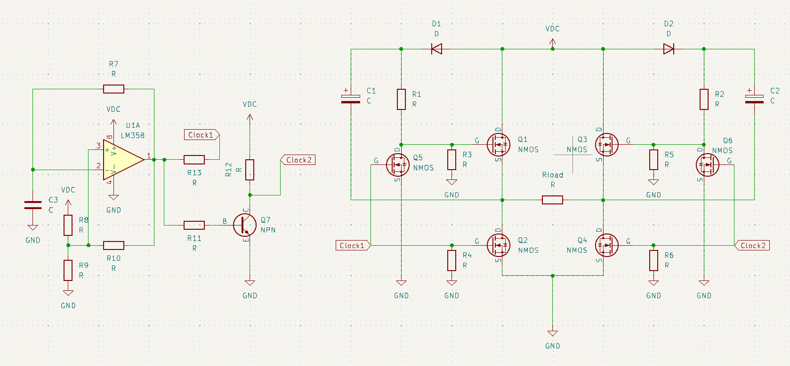

# Simple H-bridge inverter
Designed a simple DC/AC inverter, output is Square wave AC on Rload.

Used LM358 as an oscillator in a Schmitt trigger configuration.
Used a NPN transistor to invert clock for the other side of bridge FETs.

Assembled an earlier prototype and tested it with 12-24V, no magic smoke detected :)
# Schematic

